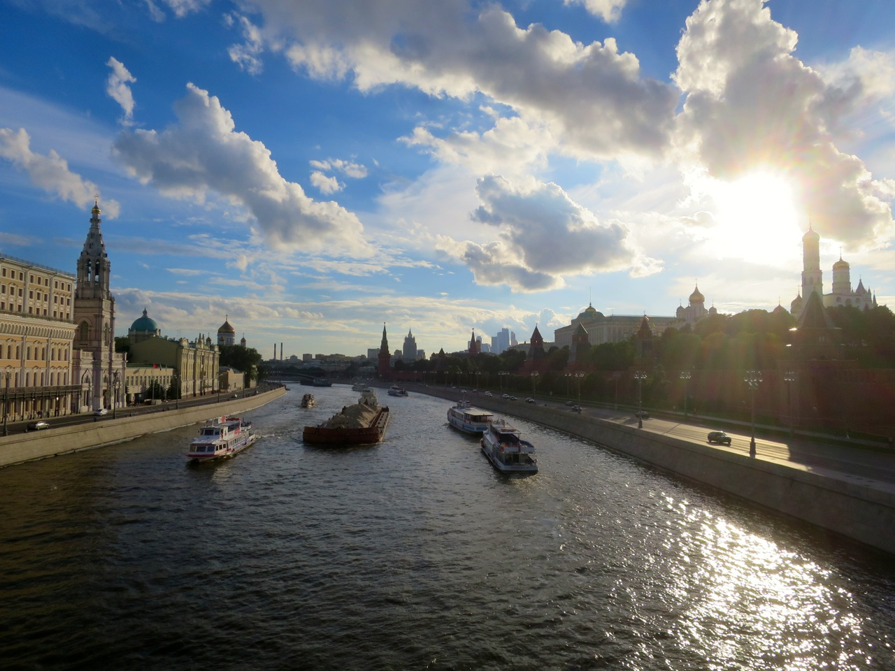

# A Bratva

<figure><figcaption>Moscou — o berço da Bratva moderna</figcaption></figure>

## Introdução

A **Bratva** (Братва, "Irmandade") é o nome informal dado ao crime organizado russo — uma das maiores e mais complexas redes criminais do mundo. Diferente das máfias tradicionais como a Cosa Nostra italiana, a Bratva não é uma organização unificada. É uma **confederação descentralizada** de grupos criminais que compartilham origens culturais, códigos de conduta e métodos de operação.

Suas raízes mergulham nos campos de trabalho forçado soviéticos — os *gulags* — onde uma aristocracia criminal se formou entre os prisioneiros, criando leis próprias, hierarquias e tradições que sobrevivem até hoje.

> *"Na Rússia, o crime organizado não existe à margem do Estado. Ele cresceu dentro dele, como um parasita que se tornou maior que o hospedeiro."*

---

## Contexto desta Wiki

Esta wiki documenta a lore de uma **célula operacional da Bratva em Nova York no início dos anos 2000**, liderada por **Viktor Petrov** — um ex-prisioneiro de gulag que construiu um pequeno império criminal nas sombras de Brighton Beach, Brooklyn.

O conteúdo é dividido em:

- **História** — As origens reais da Bratva, desde a URSS até a expansão global nos anos 90-2000
- **Organização** — Como a Bratva funciona: hierarquia, códigos, métodos, símbolos
- **A Célula de Viktor Petrov** — O grupo específico, seus membros, território e operações
- **Contexto** — O cenário de Nova York nos anos 2000 que permite essa história existir

---

## Características Fundamentais

| Aspecto | Bratva |
|---------|--------|
| **Estrutura** | Descentralizada — células independentes |
| **Base cultural** | Código dos *vory v zakone* (ladrões na lei) |
| **Territórios** | Global — Rússia, EUA, Europa, Israel |
| **Operações principais** | Lavagem de dinheiro, contrabando, fraude financeira, extorsão |
| **Violência** | Calculada e cirúrgica — nunca gratuita |
| **Relação com Estado** | Infiltração profunda — não confronto direto |

---

<figure><figcaption>Nova York — onde a Bratva encontrou seu segundo lar</figcaption></figure>

---

> *"A Bratva não precisa dominar as ruas. Ela domina os negócios por trás delas."*
