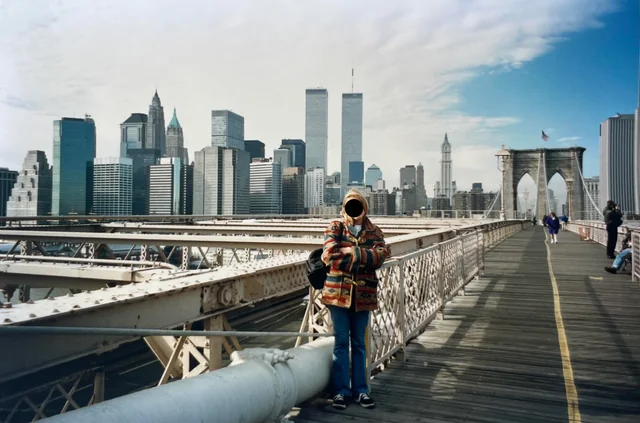

# O Submundo de Brooklyn

<figure><figcaption>Brooklyn — onde cada bairro pertence a alguém</figcaption></figure>

## Geografia Criminal

Brooklyn é o borough mais populoso de Nova York (~2.5 milhões em 2000) e também o mais diverso criminalmente. Cada bairro tem suas próprias dinâmicas, seus próprios grupos e suas próprias regras.

---

## Mapa do Submundo (c. 2002)

### Sul de Brooklyn

**Brighton Beach / Coney Island** — Território da Bratva (incluindo célula de Viktor). Comunidade russa fechada. Crimes financeiros, contrabando, extorsão discreta.

**Bensonhurst** — Tradicionalmente italiano. Restos da família Colombo e Gambino. Construção, sindicatos, jogos. Em declínio mas ainda presentes.

**Bay Ridge** — Misto. Alguns operadores independentes. Relativamente pacífico.

### Leste de Brooklyn

**East New York / Brownsville** — Gangues afro-americanas (Bloods, GD). Violência alta. Tráfico de drogas no varejo. Nenhum contato com Bratva.

**Canarsie** — Misto. Família Lucchese historicamente presente. Transição demográfica.

### Norte de Brooklyn

**Williamsburg** — Comunidade hassídica (judeus ultra-ortodoxos). Seus próprios sistemas internos. Em processo de gentrificação.

**Bushwick / Bed-Stuy** — Latin Kings, Bloods. Tráfico de crack em declínio, heroína em ascensão.

### Oeste de Brooklyn

**Red Hook** — Zona portuária/industrial. Poucos moradores. Depósitos, armazéns. **Ponto logístico da Bratva** (depósito de Viktor fica aqui).

**Park Slope / Carroll Gardens** — Gentrificação avançada. Historicamente italiano — ainda com presença residual da Cosa Nostra em negócios antigos.

---

## Regras Não Escritas

O submundo de Brooklyn funciona com regras implícitas que todos os grupos respeitam:

1. **Não operar no território alheio sem permissão** — Ou ao menos sem notificação
2. **Disputas se resolvem com conversa primeiro** — Violência é último recurso (para grupos profissionais)
3. **Civis ficam de fora** — Atacar inocentes atrai mídia e polícia
4. **Polícia tem preço** — Quem pode, compra. Quem não pode, evita.
5. **Prisão é custo de negócio** — Aceita-se sem delatar

---

## A Posição de Viktor

No ecossistema criminal de Brooklyn, Viktor ocupa uma posição **singular**:

- **Não compete** com gangues de rua (não vende drogas, não disputa esquinas)
- **Não ameaça** os italianos diretamente (não invade seus negócios tradicionais)
- **Oferece serviços** que todos precisam (lavagem, armas, documentos, contatos)

Isso o torna simultaneamente **útil** para vários grupos e **ameaçador** para nenhum — a posição ideal. Enquanto mantiver esse equilíbrio, a célula sobrevive.

O risco: crescer demais. Se Viktor ficar grande o suficiente para ser notado — seja pelos italianos, pelo FBI ou pela própria comunidade — a invisibilidade que o protege desaparece.

---

> *"Em Brooklyn, cada quarteirão tem um dono. O segredo é ser o dono que ninguém sabe que existe."*
