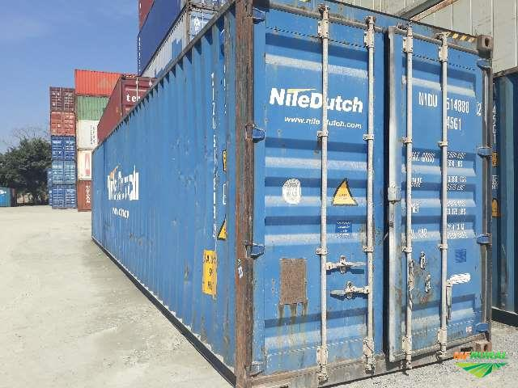

# A Bratva em Nova York

<figure><figcaption>Nova York — o maior porto de entrada da Bratva nos Estados Unidos</figcaption></figure>

## Little Odessa

A presença russa em Nova York começa muito antes do colapso soviético. Desde os anos 1970, judeus soviéticos emigraram para os EUA sob programas especiais de refúgio. A maioria se estabeleceu em **Brighton Beach**, no sul de Brooklyn — uma faixa de terra entre o oceano e a linha do metrô que rapidamente ganhou o apelido de **"Little Odessa"**.

Nos anos 80, Brighton Beach já era um mundo à parte:
- Placas em cirílico nas lojas
- Restaurantes com comida ucraniana e georgiana
- Clubes noturnos com música russa ao vivo
- Banhos turcos (*banya*) na tradição eslava
- Mercados vendendo produtos importados do Leste Europeu

Para imigrantes recém-chegados, era possível viver em Brighton Beach **sem falar uma palavra de inglês**. Essa comunidade fechada — onde todos se conheciam e ninguém confiava em estranhos — criou o ambiente perfeito para operações clandestinas.

---

## Os Pioneiros (1975-1991)

A Bratva não esperou o colapso soviético para se instalar nos EUA. Os primeiros operadores chegaram nos anos 70 e 80:

**Evsei Agron** (anos 80) — Considerado o primeiro *boss* da máfia russa em Nova York. Operava esquemas de extorsão em Brighton Beach até ser assassinado em 1985.

**Marat Balagula** (anos 80) — Montou um esquema massivo de fraude com combustível (bootleg gas) que gerava $50 milhões/ano em evasão fiscal. Mostrou à Bratva que o crime financeiro era infinitamente mais lucrativo que violência de rua.

**Vyacheslav Ivankov** ("Yaponchik") — Vor v zakone enviado de Moscou para Nova York em 1992 para "organizar" as operações americanas. Operou até ser preso pelo FBI em 1995.

Esses pioneiros estabeleceram os **padrões** que a geração seguinte — a de Viktor Petrov — herdaria e refinaria.

---

## A Grande Onda (1991-2000)

Com o colapso da URSS, a imigração russa para Nova York **explodiu**. Entre 1991 e 2000, dezenas de milhares de ex-soviéticos se instalaram em Brooklyn. A vasta maioria eram cidadãos honestos buscando oportunidade. Mas entre eles vinham os operadores:

**O que a Bratva trouxe para NY:**
- Capital acumulado na privatização selvagem
- Expertise em lavagem de dinheiro e fraude financeira
- Conexões diretas com células em Moscou, São Petersburgo, Kiev
- Conhecimento de logística (contrabando, rotas, documentos)
- Disciplina de gulag — silêncio absoluto

**O que a Bratva encontrou em NY:**
- Sistema financeiro sofisticado (bancos, bolsa, imobiliário)
- Porto e aeroporto internacionais
- Comunidade russófona que fornecia cobertura
- Autoridades focadas na Cosa Nostra italiana (ignorando russos)
- Mercado negro demandando armas, documentos, dinheiro lavado

---

## Modus Operandi em Nova York

<figure><figcaption>Os portos de Nova York — artérias do contrabando internacional</figcaption></figure>

Diferente da Cosa Nostra (que operava com violência visível e controle territorial), a Bratva em Nova York priorizava **crimes financeiros de alto valor**:

### Operações Documentadas (anos 90-2000)

| Operação | Método | Escala |
|----------|--------|--------|
| Fraude de combustível | Empresas fantasma evadindo imposto federal | ~$5 bilhões em perdas fiscais |
| Lavagem Bank of New York | Transferências via banco americano | $7 bilhões lavados (1998-99) |
| Fraude em saúde (Medicare) | Clínicas fantasma cobrando por serviços inexistentes | Centenas de milhões |
| Contrabando | Containers com mercadoria não declarada | Volume desconhecido |
| Extorsão | *Krysha* cobrada de empresários russos em NY | Disseminado mas invisível |
| Cartões de crédito | Clonagem em escala industrial | Dezenas de milhões/ano |

A sofisticação era o diferencial. Enquanto as máfias tradicionais usavam músculos, a Bratva usava **contadores, programadores e advogados**.

---

## FBI e a Percepção Tardia

O FBI demorou a perceber a ameaça. Durante os anos 80 e 90, os recursos federais estavam focados na Cosa Nostra italiana (operações como a destruição das Cinco Famílias de Nova York). Os russos eram considerados "imigrantes estrangeiros" — não uma rede criminal organizada.

Apenas em **1994** o FBI criou uma unidade específica para crime organizado eurasiano. Em 1996, o diretor do FBI Louis Freeh declarou publicamente que a máfia russa representava a "maior ameaça de crime organizado" dos Estados Unidos.

Mas a essa altura, a Bratva já estava entrincheirada — e suas operações eram sofisticadas demais para investigações tradicionais.

É neste cenário — entre a negligência das autoridades e a sofisticação dos operadores — que **Viktor Petrov** constrói sua célula em Brighton Beach.

---

> *"Os italianos construíram sua máfia em público — restaurantes, clubes, funerais com flores. Os russos construíram a deles em silêncio. Quando a polícia percebeu, já era tarde."*
