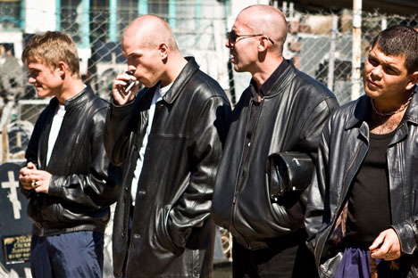

# A Bratva Hoje — O Presente

<figure><figcaption>A Bratva não desapareceu. Apenas aprendeu a ser invisível.</figcaption></figure>

## O Cenário Atual (2000-presente)

A Bratva de hoje não é a mesma dos anos 90. Evoluiu. Adaptou-se. Tornou-se mais silenciosa, mais sofisticada e infinitamente mais difícil de detectar. Os dias de execuções públicas e guerras territoriais ficaram na Rússia dos anos selvagens. O que existe agora é algo mais perigoso: uma organização que aprendeu a se parecer com o capitalismo legítimo.

---

## A Nova Bratva — Características

### Invisibilidade Total

A lição principal dos anos 2000: os que chamaram atenção foram presos. Yaponchik. Mogilevich (quase). Dezenas de operadores menores que ostentavam, falavam demais ou agiam como se Nova York fosse Moscou nos anos 90.

Os sobreviventes — como Viktor Petrov — entenderam: **o crime mais lucrativo é o que ninguém sabe que existe.**

A Bratva moderna opera sob a superfície:
- Empresários legítimos com negócios reais que geram receita real
- Impostos pagos. Contabilidade em ordem. Nada que atraia auditoria
- Membros com empregos normais, carros normais, vidas normais
- Zero ostentação. Zero violência gratuita. Zero exposição

### Crime Financeiro como Pilar

O músculo ainda existe — mas é último recurso. A verdadeira potência da Bratva em 2000+ é financeira:

| Operação | Método | Escala Estimada |
|----------|--------|-----------------|
| Lavagem de dinheiro | Empresas de fachada, imóveis, criptomoedas | Bilhões/ano (global) |
| Fraude de seguros | Acidentes falsos, clínicas fantasma | Centenas de milhões |
| Fraude de cartão | Clonagem industrial, dados roubados | Dezenas de milhões |
| Contrabando | Containers com manifesto adulterado | Volume desconhecido |
| Extorsão digital | *Krysha* moderna — proteção de dados, não de lojas | Crescente |
| Cibercrime | Ransomware, phishing, roubo de dados | Bilhões (em parceria com hackers) |

### Descentralização

Diferente da Cosa Nostra com suas Cinco Famílias, a Bratva em Nova York opera como **rede de células independentes**. Não existe um "chefe dos chefes" americano. Cada Pakhan controla seu território, seus negócios, seus homens. Cooperam quando conveniente. Competem quando necessário. Mas nunca formam uma estrutura unificada que a polícia possa decapitar.

---

## Ameaças ao Status Quo

A Bratva atual enfrenta desafios que não existiam nos anos 90:

### Pressão Federal Crescente

Após o 11 de Setembro, o governo americano expandiu massivamente a vigilância financeira. Leis anti-lavagem ficaram mais rígidas. O Patriot Act deu ao FBI ferramentas novas. A unidade de crime organizado eurasiano tem mais recursos que nunca.

### A Nova Geração

Filhos de imigrantes russos nascidos nos EUA querem entrar no jogo. Mas não respeitam o código antigo. São impulsivos. Ostentam nas redes sociais. Usam celulares sem criptografia. Não entendem que silêncio é sobrevivência.

### Competição Territorial

A Cosa Nostra enfraqueceu — mas não morreu. A Família Colombo ainda observa Brighton Beach. Gangues de rua pressionam as bordas. Novos grupos (albaneses, chineses, nigerianos) disputam espaço no submundo de Nova York.

### Tecnologia como Arma de Dois Gumes

Câmeras em toda parte. Reconhecimento facial. Interceptação de celulares. Análise de padrões financeiros por IA. O mundo ficou menor para quem quer se esconder.

Mas também: criptomoedas facilitam lavagem. Dark web permite comércio anônimo. Ransomware gera receita sem risco físico. A Bratva que souber usar tecnologia terá vantagem.

---

## A Máfia que Sobrevive

A Bratva em Nova York em 2000+ não é mais um fenômeno novo. É uma instituição. Tem quase 30 anos de presença contínua em Brighton Beach. Gerações inteiras cresceram sob sua proteção — e sua vigilância.

O que mantém a organização viva:

1. **Comunidade como escudo** — 50.000 russos que não falam com polícia
2. **Diversificação** — Múltiplos negócios, nenhum dependência de uma fonte
3. **Disciplina** — O código dos vory adaptado ao mundo moderno
4. **Paciência** — Crescimento lento é crescimento seguro
5. **Adaptação** — Os que não mudaram foram presos. Os que mudaram, prosperaram.

Viktor Petrov é prova viva dessa filosofia. Chegou em 1997 com dinheiro e contatos. Construiu em silêncio. Nunca apareceu em um jornal. Nunca foi citado em uma investigação. Nunca levantou a voz em público.

E é exatamente isso que o torna perigoso.

---

## O Futuro

A Bratva não vai desaparecer. Vai continuar evoluindo. O crime organizado russo provou, ao longo de um século, que é a coisa mais adaptável já criada por uma sociedade humana. Sobreviveu ao czarismo. Sobreviveu ao comunismo. Sobreviveu ao colapso. Sobreviveu à globalização.

Vai sobreviver ao que vier depois.

A única questão é: quem estará no comando quando a próxima era começar?

Em Brighton Beach, a resposta — por enquanto — ainda é sussurrada com respeito e medo:

*Petrov.*

---

> *"As máfias que o mundo conhece já estão mortas. As que o mundo não conhece são as únicas que importam. Nós somos a que o mundo não conhece."*
> — Viktor Petrov
