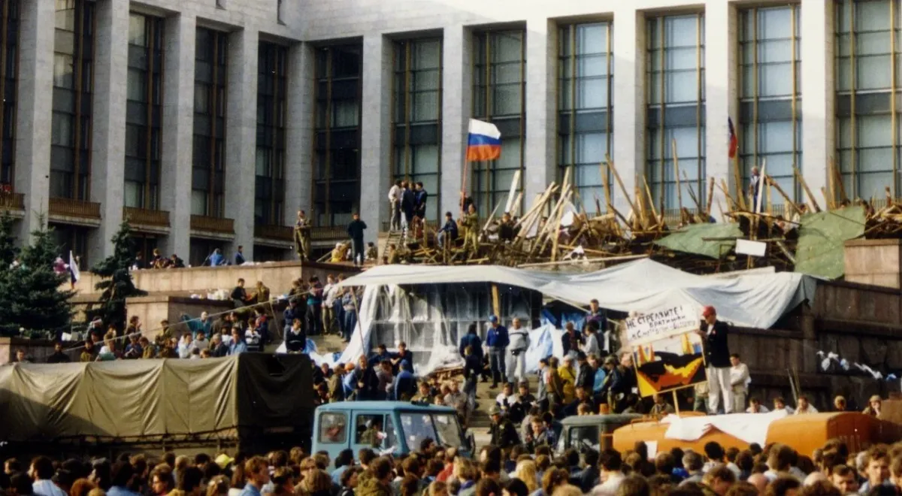
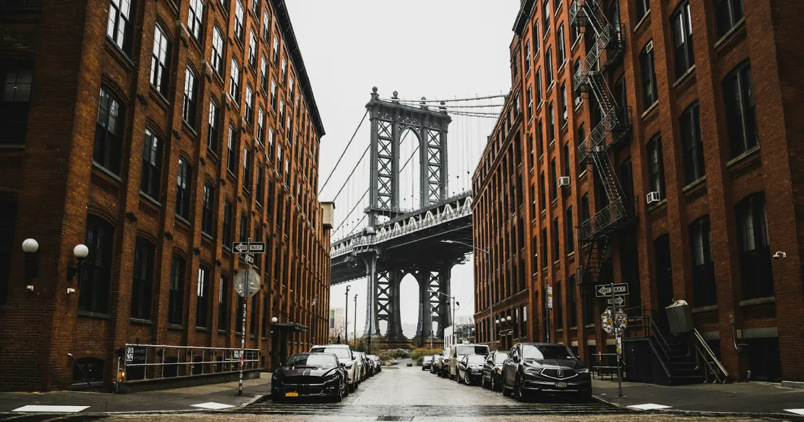

# O Colapso da URSS

<figure><figcaption>
O colapso industrial soviético — caos para milhões, oportunidade para poucos
</figcaption></figure>

## 1991 — O Fim de um Mundo

Em 25 de dezembro de 1991, a bandeira soviética foi arriada do Kremlin pela última vez. A União Soviética deixou de existir. Para 280 milhões de pessoas, o mundo que conheciam desapareceu da noite para o dia.

O que se seguiu foi o período mais caótico da história russa moderna — e o **mais lucrativo** para o crime organizado.

***

## O Caos da Privatização

O presidente Boris Yeltsin, aconselhado por economistas ocidentais, implementou a **"terapia de choque"** — uma privatização massiva e acelerada de toda a economia estatal soviética.

Na prática, isso significou:

* Milhares de empresas estatais foram vendidas por frações do valor real
* Quem tinha **dinheiro e contatos** comprou tudo — eram os futuros oligarcas
* Quem tinha **conexões criminais** aproveitou para lavar dinheiro em escala industrial
* A inflação destruiu as economias da população comum
* O Estado perdeu o monopólio sobre a violência — grupos armados privados surgiram

**Números do caos (1991-1998):**

* PIB russo caiu 40%
* Expectativa de vida masculina caiu de 64 para 57 anos
* Assassinatos triplicaram
* 80% da economia operava no "setor informal" (mercado negro)

***

## A Bratva no Meio do Furacão

Para os criminosos profissionais — os vory, os ex-prisioneiros, os operadores de mercado negro — o colapso foi um **presente**. Décadas de experiência clandestina agora valiam ouro:

### O que a Bratva fez durante a privatização:

**Extorsão em massa** — Cada novo empresário recebia uma visita. "Proteção" era obrigatória. Estima-se que em 1994, **80% das empresas privadas russas** pagavam alguma forma de _krysha_ (proteção).

**Desvio de ativos militares** — O Exército Vermelho se desintegrava. Armas, veículos, até componentes nucleares desapareciam dos arsenais. Os compradores: Bratva, warlords africanos, cartéis, terroristas.

**Lavagem de privatização** — Criminosos usavam dinheiro do tráfico e extorsão para comprar empresas estatais nos leilões. Dinheiro sujo se tornava capital "legítimo" instantaneamente.

**Bancos** — A Bratva criou ou comprou centenas de bancos entre 1992-1998. Sem regulação efetiva, esses bancos lavavam bilhões e financiavam operações em todo o mundo.

**Assassinatos por contrato** — O "negócio" mais direto: entre 1992-2000, centenas de empresários, jornalistas, políticos e banqueiros foram executados na Rússia. A taxa de resolução policial era inferior a 10%.

***

## A Diáspora Criminal

<figure><figcaption>
A Bratva se globalizou junto com a diáspora russa
</figcaption></figure>

O colapso também gerou uma **onda migratória massiva**. Milhões de cidadãos ex-soviéticos emigraram para o Ocidente entre 1989-2000. Entre eles — engenheiros, médicos, professores, artistas. Mas também:

* Criminosos fugindo de rivais ou da polícia
* Operadores financeiros buscando novos mercados
* Ex-militares e agentes de inteligência desempregados
* Jovens ambiciosos sem futuro na nova Rússia

Os destinos principais:

* **Israel** — Política de _aliyah_ permitia imigração automática
* **Alemanha** — Grande comunidade russófona
* **Estados Unidos** — Brighton Beach (Brooklyn), Los Angeles, Chicago

Essas comunidades de imigrantes se tornaram **bases de operação** para a Bratva no exterior. Escondidos entre milhares de imigrantes legítimos, os criminosos tinham cobertura perfeita, acesso a novos mercados e conexão direta com a rede na Rússia.

***

## O Cenário em 1997

Quando **Viktor Petrov** desembarca em Nova York em 1997, este é o mundo que ele deixa para trás — e que traz consigo:

* Uma Rússia onde o crime e o capitalismo se fundiram
* Contatos em Moscou que operam bancos e empresas de fachada
* Experiência de gulag que lhe deu o código e a rede
* Dinheiro acumulado no caos da privatização
* A certeza de que nos EUA, longe dos olhos da polícia russa, ele pode construir algo próprio

A Rússia o forjou. A América seria seu campo de operações.

***

> _"Na Rússia, roubamos do Estado porque o Estado roubou de nós primeiro. Na América, é ainda mais fácil — aqui ninguém sequer sabe que estamos aqui."_
