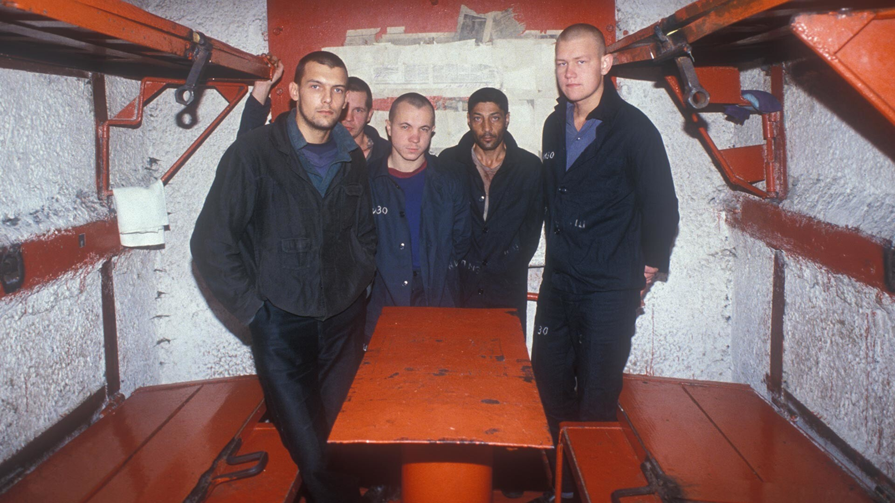

# Os Vory v Zakone

<figure><figcaption>As tatuagens dos vory contam sua história sem palavras</figcaption></figure>

## Os Ladrões na Lei

Os **Vory v Zakone** (Воры в Законе — literalmente "Ladrões na Lei") são a elite do crime organizado russo. Não são simplesmente criminosos — são uma **casta**, com rituais de iniciação, código de conduta rígido e status quase religioso dentro do submundo.

O título de *vor* (ladrão) não é autoproclamado. É **concedido** por outros vory em uma cerimônia formal chamada *skhodka* (reunião). Para ser coroado, um candidato deve:

- Ter histórico criminal comprovado
- Jamais ter cooperado com autoridades
- Ser indicado por pelo menos dois vory existentes
- Aceitar publicamente o código
- Nunca ter servido nas forças armadas soviéticas

---

## O Código (Ponyatiya)

O código dos vory — chamado *ponyatiya* (понятия, "entendimentos") — é um conjunto de regras que governam a vida de um ladrão coroado:

### Regras Fundamentais

| Nº | Regra | Significado |
|----|-------|-------------|
| 1 | Renunciar à família | Um vor não tem esposa, filhos ou laços oficiais. A Bratva é sua família. |
| 2 | Nunca trabalhar | Um vor jamais tem emprego legítimo. Vive exclusivamente do crime. |
| 3 | Nunca cooperar com o Estado | Nenhuma forma de colaboração — nem serviço militar, nem delação. |
| 4 | Manter o obshchak | Contribuir com porcentagem dos lucros para o fundo comum. |
| 5 | Ser honesto com irmãos | Jamais roubar de outro vor ou mentir em reunião. |
| 6 | Recrutar novos membros | Trazer jovens promissores para o caminho. |
| 7 | Nunca se envolver em política | O vor está acima de partidos e governos. |
| 8 | Aceitar punição se condenado | Se o tribunal dos vory decide, não há recurso. |

### Punições por Violação

As punições variam conforme a gravidade:

- **Advertência** (*preduprezhdenie*) — Para falhas menores
- **Rebaixamento** — Perda do título de vor
- **Exclusão** — Banimento total da irmandade
- **Morte** — Para traição, cooperação com polícia ou roubo do obshchak

> *"O código não é escrito em papel. É escrito na pele, no sangue e na memória dos que sobrevivem."*

---

## A Guerra das Cadelas (Suchya Voyna)

<figure><figcaption>Os gulags do pós-guerra — cenário da guerra que dividiu os vory</figcaption></figure>

Durante a Segunda Guerra Mundial (1941-45), o governo soviético ofereceu aos prisioneiros dos gulags uma proposta: **lutar no front em troca de liberdade**. Muitos vory aceitaram — violando diretamente o código que proibia cooperação com o Estado.

Quando a guerra terminou e esses homens retornaram aos campos, os vory "tradicionais" (que recusaram a oferta) os declararam **suki** (cadelas/traidores). O que se seguiu foi a **Suchya Voyna** — a Guerra das Cadelas — um conflito brutal dentro dos gulags que durou de 1945 a 1953.

**Consequências da guerra:**
- Milhares de mortos nos campos
- A classe dos vory se fragmentou permanentemente
- Novos códigos emergiram — mais flexíveis, mais pragmáticos
- As "novas regras" permitiriam eventualmente que vory tivessem famílias e negócios

Esta fragmentação é crucial para entender a Bratva moderna: os vory **pós-guerra** são menos dogmáticos, mais focados em lucro e mais dispostos a se adaptar — é desse ramo que surgem os líderes criminais dos anos 90 e 2000.

---

## Os Vory na Era Moderna

Nos anos 90 e 2000, os vory v zakone ainda existem — mas transformados:

**Vory Tradicionais:**
- Seguem o código original rigidamente
- Rejeitam ostentação
- Atuam como mediadores e juízes do submundo
- Cada vez mais raros

**Vory Modernos ("Autoridades"):**
- Código flexibilizado
- Possuem negócios, famílias, propriedades
- Focam em operações financeiras complexas
- Conectados globalmente — Rússia, Europa, EUA, Israel

Viktor Petrov se posiciona entre esses dois mundos. Carrega as tatuagens e respeita o código antigo — mas opera com a pragmatismo dos novos tempos. Não é um vor coroado formalmente, mas vive segundo os princípios. Em Brighton Beach, isso lhe garante respeito tanto dos velhos quanto dos jovens.

---

> *"Vor não é um título que se compra. É um peso que se carrega. Muitos querem o respeito — poucos aguentam o preço."*
