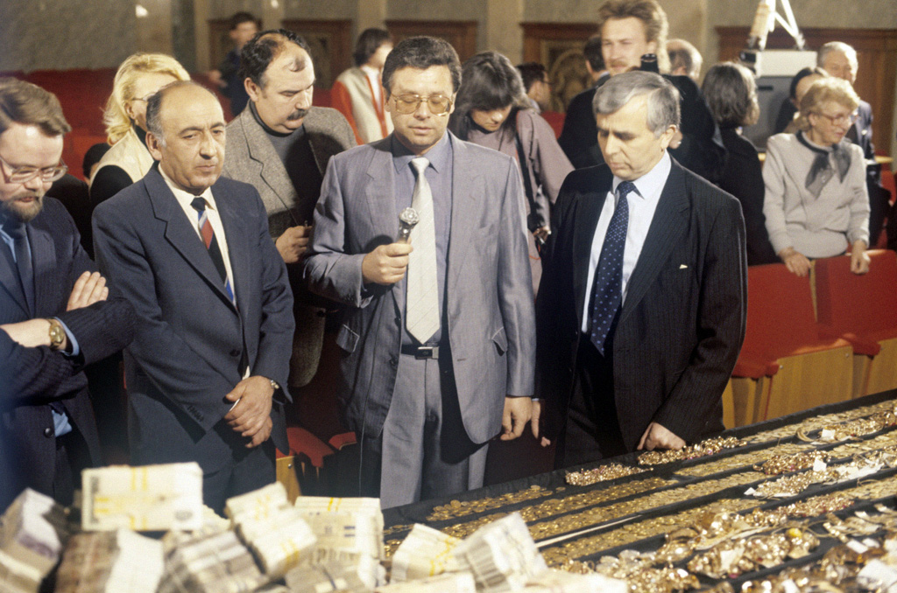
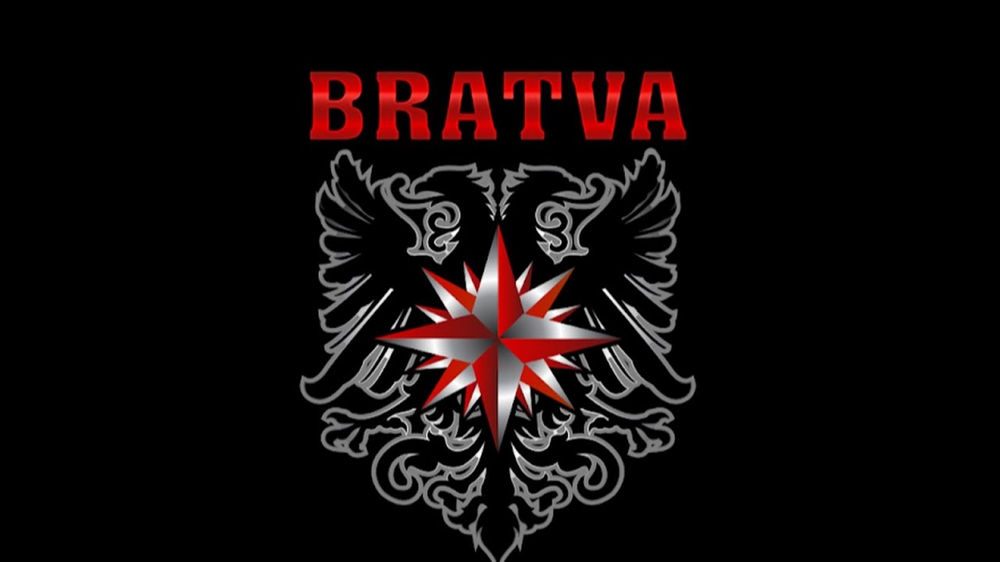

# Estrutura e Hierarquia

<figure><figcaption>A hierarquia da Bratva opera nas sombras — invisível mas absoluta</figcaption></figure>

## Organização Descentralizada

A Bratva **não** funciona como a máfia italiana. Não existe um "chefe dos chefes" (*capo di tutti capi*). Não há uma pirâmide unificada. Em vez disso, a Bratva opera como uma **rede de células independentes**, cada uma com seu próprio líder, território e especialização.

Essas células se conectam por:
- Relações pessoais (muitas vezes forjadas nos gulags)
- Transações comerciais (compram e vendem serviços entre si)
- O código compartilhado dos vory
- Reuniões (*skhodki*) para resolver disputas

Essa estrutura torna a Bratva **extremamente resistente** à repressão policial. Derrubar uma célula não afeta as outras. Prender um líder não destrói a rede.

---

## A Hierarquia de uma Célula

Embora cada célula tenha autonomia, a estrutura interna segue um padrão comum:

### Pakhan (Пахан) — O Chefe

O líder absoluto da célula. Toma decisões estratégicas, resolve conflitos e mantém relações com outras células e organizações. Raramente se envolve em operações diretas — isso o protege legalmente.

**Características:**
- Respeito absoluto dos subordinados
- Geralmente mais velho e experiente
- Mantém perfil baixo — nunca ostenta
- Responsável pelo bem-estar de todos os membros

### Sovetnik (Советник) — O Conselheiro

Braço direito do Pakhan. Cuida de estratégia, logística e inteligência. Em muitas células, é o verdadeiro "cérebro" operacional.

**Funções:**
- Aconselhar o Pakhan em decisões complexas
- Mediar conflitos internos
- Manter contatos com outras organizações
- Substituir o Pakhan se necessário

### Brigadir (Бригадир) — Líder de Equipe

Comandante de campo. Cada brigadir controla uma equipe de 3-8 homens e é responsável por operações específicas (logística, extorsão, fraude, segurança).

**Características:**
- Ponto de contato entre liderança e soldados
- Operacionalmente independente em sua área
- Reporta diretamente ao Pakhan ou Sovetnik

### Boets (Боец) — Soldado

A força de trabalho da célula. Executa operações: coletas, entregas, vigilância, intimidação e — quando necessário — violência.

**Regras:**
- Obedece ao Brigadir sem questionar
- Não conhece a estrutura completa
- Recebe porcentagem dos lucros da operação

### Shestyorka (Шестёрка) — Associado

O degrau mais baixo. "Número seis" — faz trabalhos sujos sem conhecer nada da organização. São testados antes de qualquer promoção. Descartáveis.

---

## O Obshchak (Общак) — O Fundo Comum

<figure><figcaption>O obshchak é sagrado — roubar dele é sentença de morte</figcaption></figure>

Toda célula mantém um **obshchak** — um fundo comum alimentado por porcentagem dos lucros de cada operação. Este dinheiro é usado para:

- Suborno de policiais e funcionários
- Pagamento de advogados
- Sustento de famílias de membros presos
- Financiamento de novas operações
- Emergências (fuga, esconderijos)

O obshchak é **sagrado**. Roubar dele é a maior ofensa possível — punida invariavelmente com morte. O Pakhan é o guardião e administrador do fundo.

---

## Comparação com a Cosa Nostra

| Aspecto | Cosa Nostra (Italianos) | Bratva (Russos) |
|---------|------------------------|-----------------|
| Estrutura | Piramidal, hierárquica | Rede descentralizada |
| Liderança | Hereditária/familiar | Meritória/criminal |
| Território | Fixo e disputado | Flexível e comercial |
| Violência | Frequente e pública | Rara e cirúrgica |
| Foco | Proteção, jogo, drogas | Finanças, fraude, lavagem |
| Recrutamento | Laços familiares/étnicos | Experiência criminal |
| Código | *Omertà* (silêncio) | *Ponyatiya* (entendimentos) |

---

> *"A máfia italiana é um exército. A Bratva é uma teia. Corte um fio e os outros se reconectam."*
